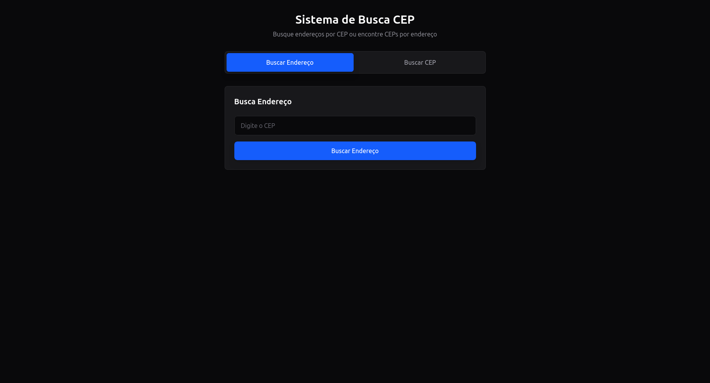

# Sistema de Busca CEP

Um aplicativo web moderno e responsivo desenvolvido com React e Vite, integrado à API do ViaCEP para localização de endereços e códigos postais em tempo real.

## Funcionalidades

- **Busca por CEP**: Informe o código postal para obter o endereço completo instantaneamente.

- **Busca por Endereço**: Encontre CEPs filtrando por Estado (UF), Cidade e Nome da Rua.

- **Interface Inteligente**: Alternância simples entre modos de busca com feedback visual.

- **Tratamento de Erros**: Validação de dados e mensagens amigáveis para CEPs não encontrados ou falhas de conexão.

- **Design Premium**: Interface em modo escuro (Dark Mode) construída com Tailwind CSS v4.

## Tecnologias Utilizadas

- React (com Vite para alta performance)
- Tailwind CSS v4 (estilização moderna e utilitária)
- Lucide React (ícones vetoriais)
- React UseAnimations (animações de carregamento fluidas)
- ViaCEP API (serviço de dados postais)

## Como rodar o projeto

1. Clone este repositório:
```bash
git clone https://github.com/gabrieltm-sudo/busca-cep.git
```

2. Instale as dependências:
```bash
npm install
```

3. Inicie o servidor de desenvolvimento:
```bash
npm run dev
```

## Demonstração



## Autor

Desenvolvido por Gabriel Torres Machado — Estudante de Engenharia de Computação na UNIPAMPA (Bagé, RS).